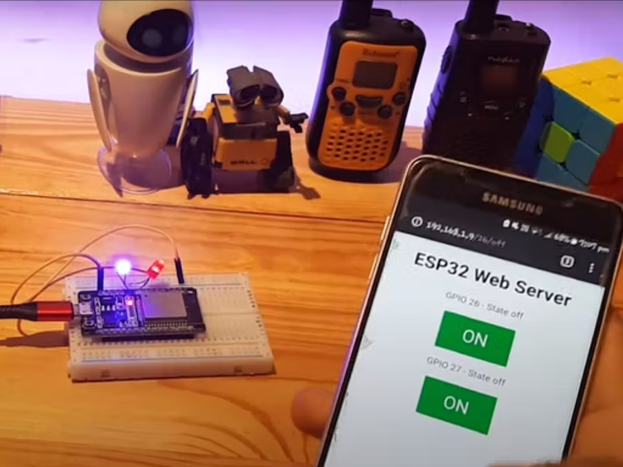

Control any appliance by attaching relay module using wifi.

YouTube link:-

- [Youtube video](https://www.youtube.com/watch?v=Hgq2KX5w-_o)

- [Arduino website](https://create.arduino.cc/projecthub/kunshmaurya/wifi-esp32-led-control-project-42f36c)

